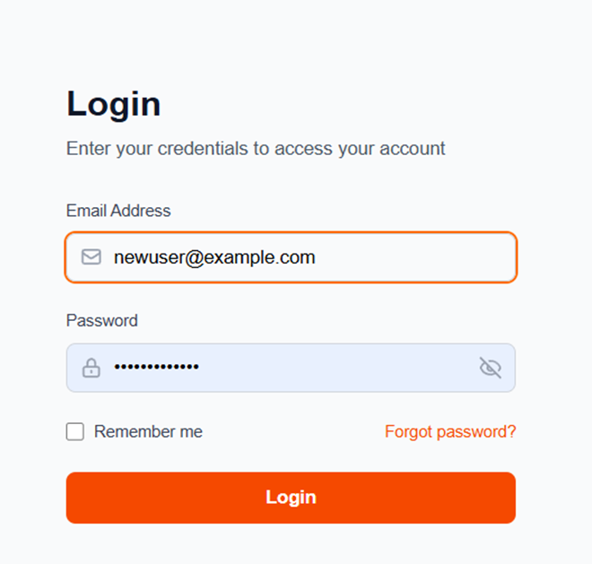
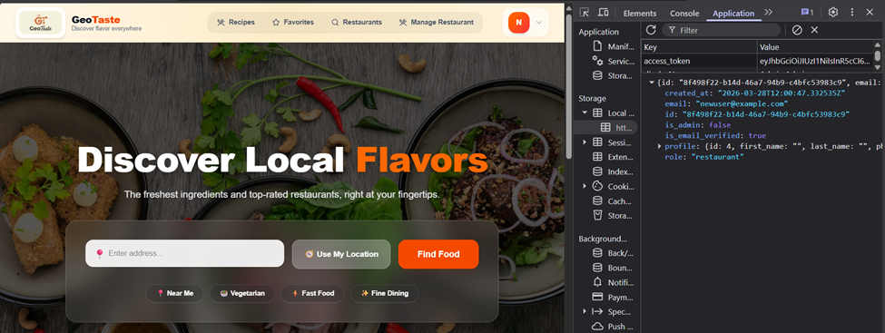
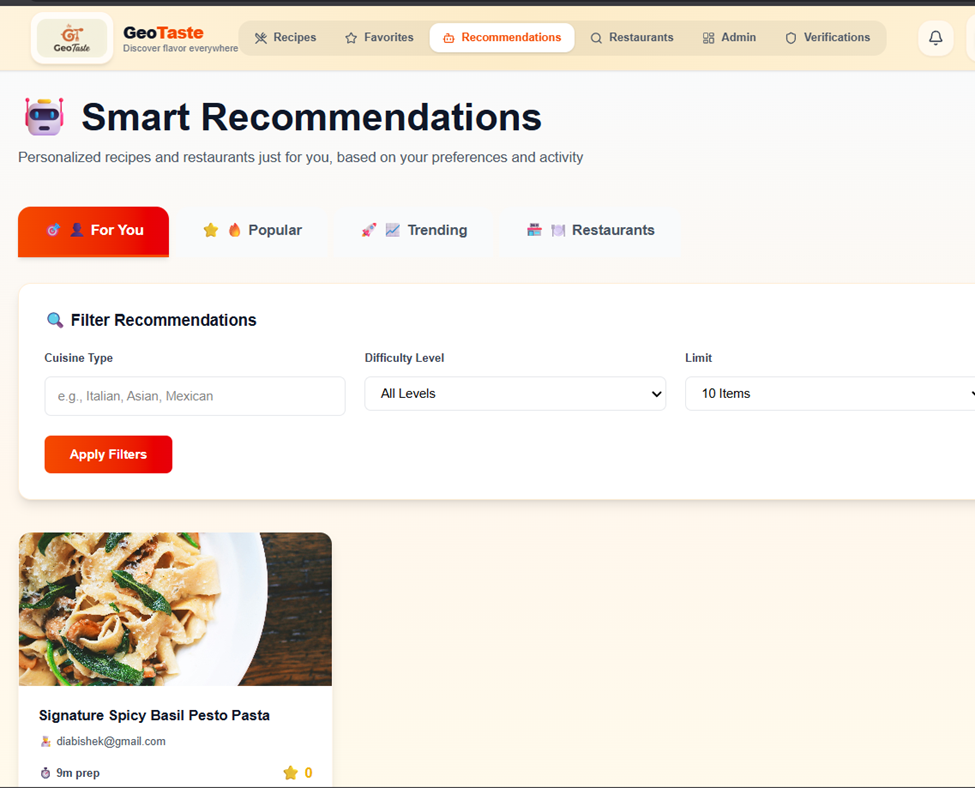

# GeoTaste

## Short Description
GeoTaste is a location-based food discovery platform. This repository contains a production-ready authentication, authorization, profile management, and dashboard system built with React (Vite) and Django REST Framework.

## Project Objective
The objective of this project is to provide a secure, role-based system that helps users register, log in, manage profiles, and access dashboards based on their role through a simple and efficient interface.

## Features
- User registration and login (JWT-based authentication)
- Password reset with OTP and password change
- Role-based access control (Normal, Store, Restaurant, Admin)
- Profile management (common + role-specific)
- User/Admin dashboards
- Validation and security best practices (CORS, password rules, secure hashing)
- Recommendation system for recipe and restaurant

## Technologies Used

### Frontend
- React (Vite)
- Tailwind CSS
- React Router
- Axios
- Lucide React

### Backend
- Django
- Django REST Framework
- Django REST Framework Simple JWT
- Django CORS Headers

### Database
- PostgreSQL 


## Requirements

### Hardware
- Computer (or a capable smartphone for viewing the frontend)
- Stable internet connection (for dependencies and API calls)

### Software
- Python 3.8+
- Node.js 16+
- npm (or yarn)
- A modern browser (Chrome/Edge/Firefox)

## Steps to Run the Project Locally

### 1) Clone the repository
```bash
git clone <https://github.com/Diamond10011/diamond-baruwal-geotaste.git>
cd <GeoTaste>
```

### 2) Backend setup (Django)
```bash
cd backend
python -m venv venv
venv\Scripts\activate
pip install -r requirements.txt
python manage.py makemigrations
python manage.py migrate
python manage.py createsuperuser
python manage.py runserver
```
Backend runs at `http://localhost:8000`.

### 3) Frontend setup (React)
```bash
cd Frontend
npm install
npm run dev
```
Frontend runs at `http://localhost:5173`.


## Example Project Structure
```text
GeoTaste/
|-- backend/
|   |-- manage.py
|   |-- backend/
|   |   |-- settings.py
|   |   `-- urls.py
|   `-- users/
|       |-- models.py
|       |-- serializers.py
|       |-- urls.py
|       `-- views.py
|-- Frontend/
|   |-- package.json
|   `-- src/
|       |-- components/
|       |-- context/
|       |-- pages/
|       |-- App.jsx
|       `-- main.jsx
`-- ReadMe.md
```

## Screenshots
Add screenshots of the system here:
- Login page: 
- Home Page: 
- Main feature pages: 

## API Endpoints Overview

### Authentication
- `POST /api/register/` - Register new user
- `POST /api/login/` - Login user
- `POST /api/logout/` - Logout user
- `POST /api/verify-email/` - Verify email with OTP
- `POST /api/forgot-password/` - Request password reset
- `POST /api/reset-password/` - Reset password with OTP

### User Management
- `GET /api/me/` - Get current user
- `GET /api/profile/` - Get user profile
- `PUT /api/profile/` - Update user profile
- `POST /api/change-password/` - Change password

### Role-Specific APIs
- `GET /api/store-profile/` - Store user profile
- `PUT /api/store-profile/` - Update store profile
- `GET /api/restaurant-profile/` - Restaurant user profile
- `PUT /api/restaurant-profile/` - Update restaurant profile

### Dashboards
- `GET /api/user-dashboard/` - User dashboard data
- `GET /api/admin-dashboard/` - Admin dashboard data

## User Roles
- Normal User: browse restaurants and ingredients; manage profile; access user dashboard
- Store User: manage store details; list ingredients for sale; upload business license
- Restaurant User: manage restaurant details/menus; upload business license
- Admin: manage users/roles; access system statistics and administration endpoints

## Key Components (Frontend)
- `FormComponents.jsx`: shared form inputs, buttons, alerts, cards, and loading states
- `AuthContext.jsx`: auth state, token persistence, and API helpers
- `ProtectedRoute.jsx`: role-based route protection and redirects

## Validation Notes
- Password: minimum 8 characters; at least one uppercase, one lowercase, and one digit
- Email: valid email format required
- Frontend validates for UX; backend validates for security

## Possible Improvements (Future Work)
- Mobile application version
- Improved user interface and UX
- Additional security features
- More advanced analytics and reporting
- Production 

## Student Information
- Student Name: DIAMOND BARUWAL
- Program/Department: BIT (hons.)Computing
- University/College: Ithari International College

## License
This project is proprietary and intended for educational purposes as part of a Final Year Project.

---
